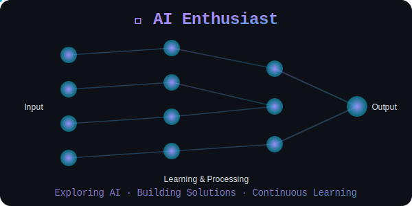
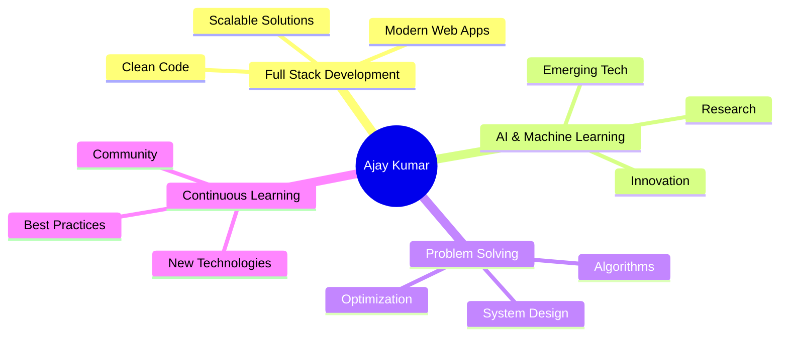

<div align="center">

[](https://www.linkedin.com/in/ajay-kumar-reddy7411/)
[](mailto:akumar23755@gmail.com)
[](https://leetcode.com/u/0DmMUh1UpK/)
[](https://github.com/YOUR_GITHUB_USERNAME)

</div>

<br>

## 🚀 About Me

```typescript
const ajay = {
    role: "Full Stack Developer & Student",
    passion: "Building impactful software solutions",
    interests: ["AI/ML", "Web Development", "Problem Solving"],
    currentlyLearning: "Advanced AI & Emerging Technologies",
    motto: "Code with purpose, learn with passion"
};
```

<br>

## 💻 Tech Stack

<div align="center">


</div>

<div align="center">

### Languages & Frameworks


### Databases & Tools


</div>

<br>

## 🤖 AI & Machine Learning

<div align="center">



</div>

<br>

## 📊 Coding Activity

<div align="center">



</div>

<br>

## 📈 GitHub Stats

<div align="center">
  
  
</div>

<div align="center">
  
</div>

<br>

## 🎯 What I'm Passionate About

<div align="center">



</div>

<br>

## 🌟 Philosophy

<div align="center">

> *"Building software that makes a difference, one commit at a time"*

</div>

<br>

## 📫 Let's Connect!

<div align="center">

I'm always excited to collaborate on innovative projects, discuss new technologies, or connect with fellow developers and AI enthusiasts!

[](https://www.linkedin.com/in/ajay-kumar-reddy7411/)
[](mailto:akumar23755@gmail.com)

</div>

<br>

<div align="center">
  
</div>

---


<div align="center">
  
### ⭐ From [Ajay Kumar](https://github.com/YOUR_GITHUB_USERNAME)

</div>
